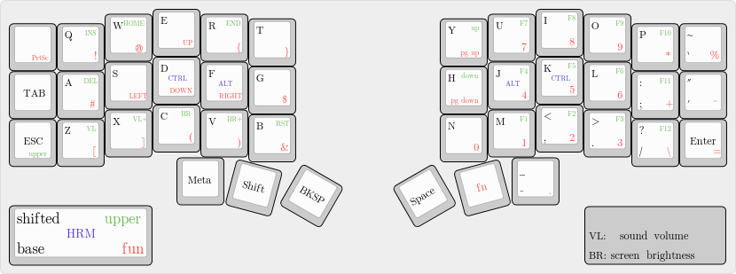

# qmk-config



> image generated with http://www.keyboard-layout-editor.com


## Changelog

- Initial layout from [technomancy](https://atreus.technomancy.us/cheat.pdf).
- Adapted to fit a 42 keys layout, moving ctrl and alt to the home row using combos.
- Replaced combos to use proper home-row-mods thanks to [achordion](https://getreuer.info/posts/keyboards/achordion/).


## Built

Run the following commands to build the firmware:

```
nix shell nixpkgs#qmk
qmk setup
ln -s $(pwd) /home/fedora/qmk_firmware/keyboards/moonlander/keymaps/moonwalker
qmk compile -kb moonlander -km moonwalker
```
